# Audit API - Sequence Diagrams

## Positive Scenario: Retrieve Audit History List Successfully

This diagram shows the successful flow of retrieving audit history data.

```mermaid
sequenceDiagram
    participant Test as Test Runner
    participant Step as Step Definition
    participant Client as AuditApiClient
    participant Auth as AuthenticationClient
    participant API as Audit API
    participant Report as ExtentReport

    Test->>Step: Execute Scenario 001
    Note over Test,Step: "Retrieve audit history list successfully"
    
    Step->>Client: GetAuditHistoryListAsync()
    activate Client
    
    Client->>Auth: GetAccessTokenAsync()
    activate Auth
    Auth->>API: POST /token
    API-->>Auth: 200 OK (access_token)
    Auth-->>Client: Return access_token
    deactivate Auth
    
    Note over Client: Build request with headers:<br/>Authorization: Bearer {token}<br/>Accept: application/json<br/>ObjectId, Cored, Type
    
    Client->>API: GET /audit-history
    activate API
    
    Note over API: Process request<br/>Validate authentication<br/>Query database
    
    API-->>Client: 200 OK (JSON array)
    deactivate API
    
    Client-->>Step: RestResponse (Status: 200)
    deactivate Client
    
    Step->>Step: Assert status code = 200
    Step->>Step: Assert Content-Type = "application/json"
    Step->>Step: Assert response is JSON array
    Step->>Step: Validate each item has required fields
    Step->>Step: Validate GUIDs are valid
    Step->>Step: Validate timestamps are ISO 8601
    
    Step->>Report: CreateNode<Given>("request audit history")
    Step->>Report: CreateNode<Then>("status code = 200") ✅
    Step->>Report: CreateNode<Then>("validate response") ✅
    
    Step-->>Test: Scenario PASSED ✅
    
    Note over Test,Report: All assertions passed<br/>Report updated with success
```

---

## Negative Scenario: Retrieve Audit History Without Authentication

This diagram shows the flow when authentication fails (401 Unauthorized).

---

## Alternative Negative Scenario: Retrieve Audit History with Insufficient Permissions

This diagram shows the flow when user lacks proper permissions (403 Forbidden).

---

## Detailed Flow: Retrieve Audit History by ID (Positive with Full Details)

This diagram shows a more detailed flow including all components.

---

## Error Flow: Retrieve Audit History by Non-Existent ID (Negative)

```mermaid
sequenceDiagram
    participant Test as Test Runner
    participant Step as Step Definition
    participant Client as AuditApiClient
    participant Auth as AuthenticationClient
    participant API as Audit API
    participant Report as ExtentReport

    Test->>Step: Execute Scenario 012
    Note over Test,Step: "Retrieve by ID that does not exist"
    
    Step->>Step: Set auditHistoryId = "00000000-0000-0000-0000-000000000000"
    
    Step->>Client: GetAuditHistoryByIdAsync("00000000-...", true)
    activate Client
    
    Client->>Auth: GetAccessTokenAsync()
    Auth->>API: POST /token
    API-->>Auth: 200 OK (token)
    Auth-->>Client: access_token
    
    Client->>API: GET /audit-history/00000000-0000-0000-0000-000000000000
    activate API
    
    Note over API: 1. Validate token ✅<br/>2. Parse GUID ✅<br/>3. Query database<br/>4. No record found ❌
    
    API-->>Client: 404 Not Found
    Note over API: Response:<br/>{<br/>  "error": "Not Found",<br/>  "message": "Audit history not found"<br/>}
    deactivate API
    
    Client-->>Step: RestResponse (Status: 404)
    deactivate Client
    
    Step->>Step: Assert status code = 404 ✅
    
    Step->>Report: CreateNode<When>("request non-existent ID")
    Step->>Report: CreateNode<Then>("status code = 404") ✅
    
    Step-->>Test: Scenario PASSED ✅
    
    Note over Test,Report: Negative test successful<br/>Error handling verified
```

---

## Legend

### Participants
- **Test Runner**: xUnit test execution engine
- **Step Definition**: BDD step implementation (Given/When/Then)
- **AuditApiClient**: Core API client for Audit endpoints
- **AuthenticationClient**: Handles OAuth token retrieval
- **Audit API**: Target API server
- **ExtentReport**: HTML report generation

### Status Indicators
- ✅ Success / Assertion passed
- ❌ Failure / Record not found
- 🔒 Authentication/Authorization check

### HTTP Status Codes
- **200 OK**: Successful request
- **401 Unauthorized**: Missing or invalid authentication
- **403 Forbidden**: Valid auth but insufficient permissions
- **404 Not Found**: Resource doesn't exist

---

## Key Takeaways

### Positive Scenario Benefits
1. ✅ Validates happy path functionality
2. ✅ Confirms authentication flow works
3. ✅ Verifies response structure and data
4. ✅ Tests end-to-end integration

### Negative Scenario Benefits
1. ✅ Validates error handling
2. ✅ Confirms security measures work
3. ✅ Tests API resilience
4. ✅ Verifies proper HTTP status codes

### Framework Features Highlighted
1. 🔄 Reusable API clients
2. 🔐 Centralized authentication
3. 📊 Comprehensive reporting
4. 🎯 BDD test structure
5. ✨ Clean separation of concerns
